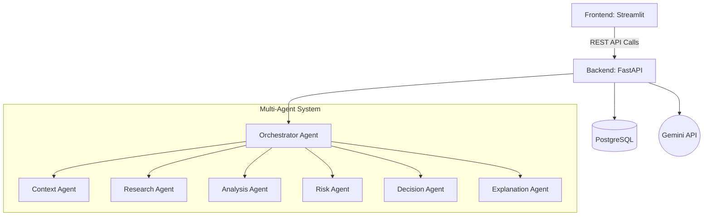

# System Architecture

DecisionPilot is designed as a modular, scalable, and decoupled platform. It separates the user interface from the heavy reasoning engine, allowing both to scale and evolve independently.

## High-Level Diagram

## Component Breakdown

### 1. Frontend (Streamlit)
The frontend is built using Streamlit, focusing on rapid development of data applications.
- **Pages**: Separated into Home, Decision Interface, History, and Analytics.
- **Visualizations**: Uses `Plotly` for rendering score breakdowns and `AgGrid` for detailed comparison matrices.
- **State Management**: Handles conversational state with the Context Agent and manages long-polling or loading states while the Orchestrator runs.

### 2. Backend (FastAPI)
A high-performance asynchronous web framework handling the core business logic.
- **RESTful Endpoints**: Exposes APIs for the frontend to submit queries and retrieve decisions.
- **Pydantic Validation**: Ensures all data coming in and out of the API (and between agents) strictly conforms to predefined JSON schemas.
- **Dependency Injection**: Manages database sessions and API clients (like the Gemini SDK).

### 3. Orchestration Layer (LangGraph / Custom)
The orchestrator is the conductor of the multi-agent system.
- It receives the initial user payload.
- It sequentially triggers each of the 6 specialized agents.
- It passes the structured JSON output of one agent as the input to the next.
- It handles error recovery (e.g., if an agent's output is malformed, it asks the LLM to fix it).

### 4. Database (PostgreSQL / SQLAlchemy)
Stores the application state persistently.
- **Users**: (If authentication is added)
- **Decisions**: Logs the complete input, context, research data, risk scores, and final explanation.
- **Agent Logs**: Stores the intermediate JSON payloads for debugging and analytics.
